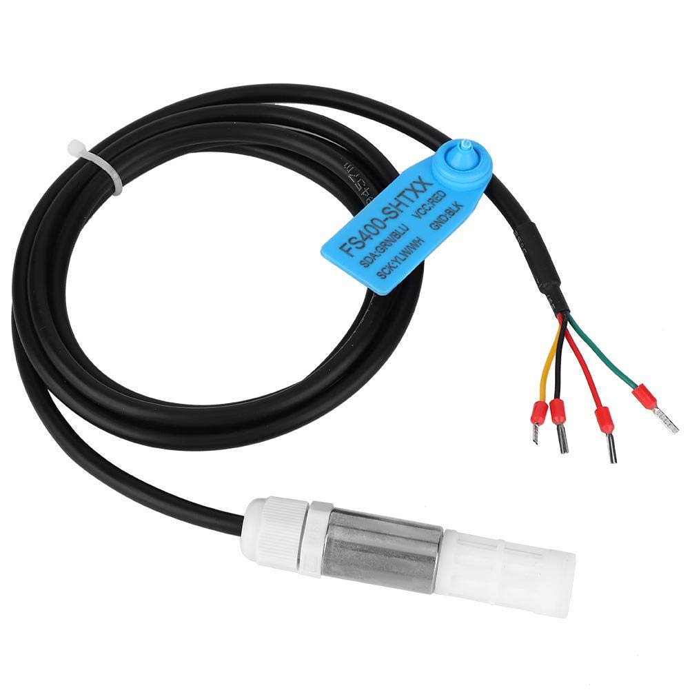
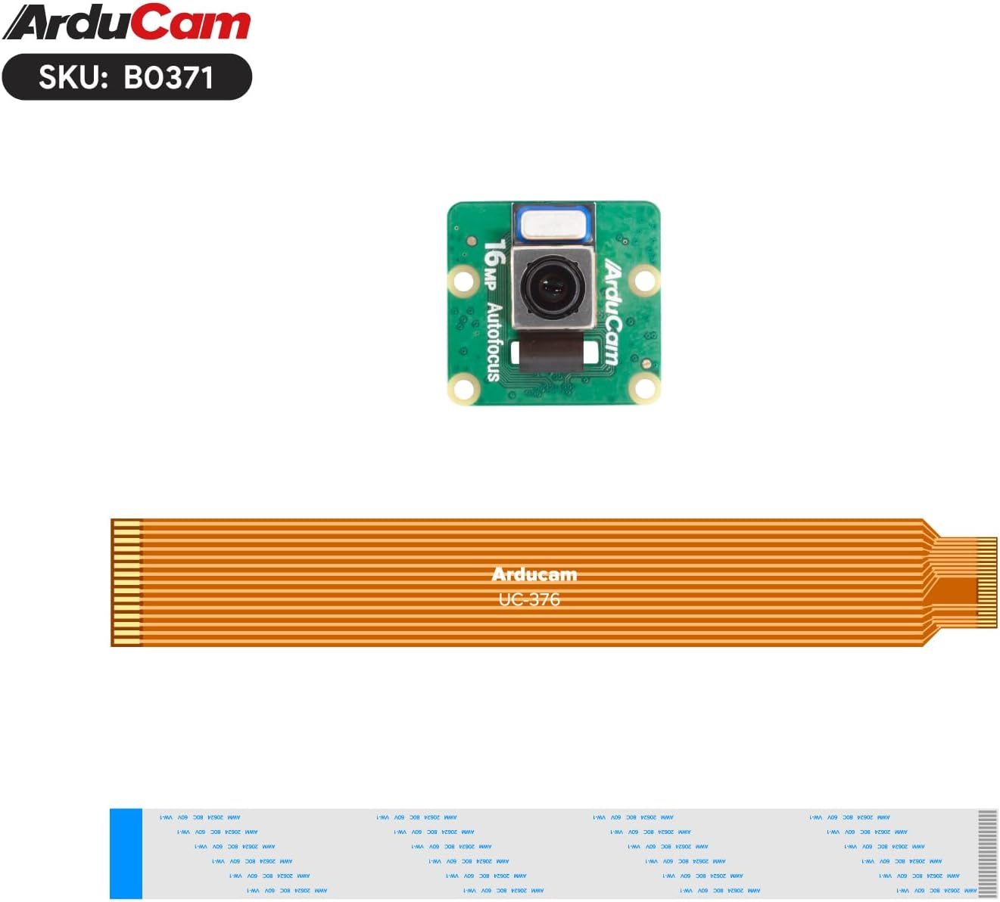
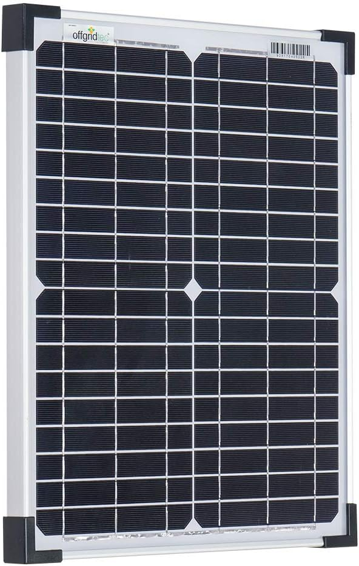
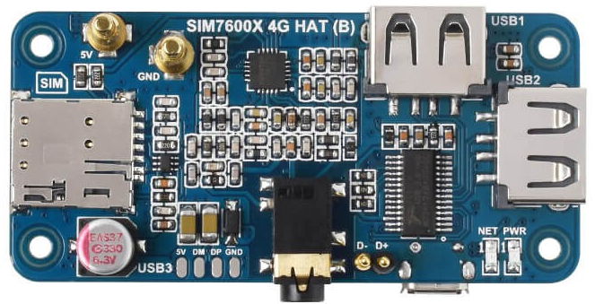
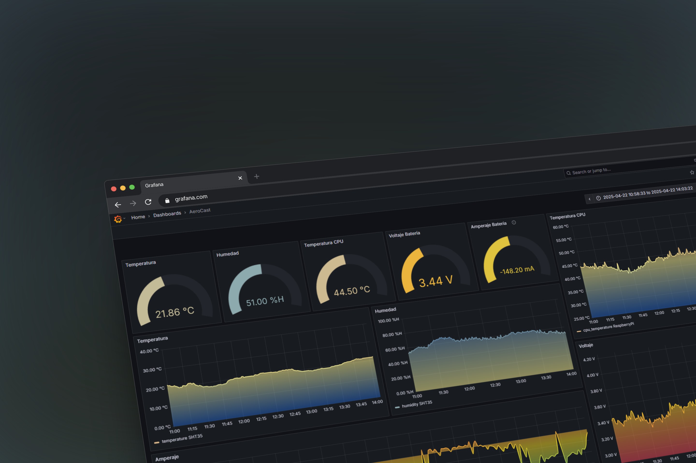
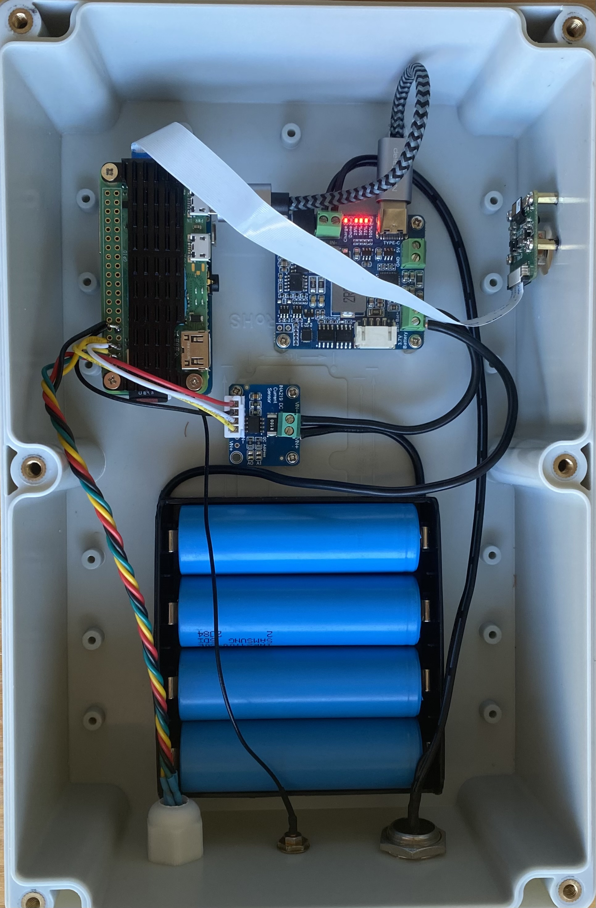
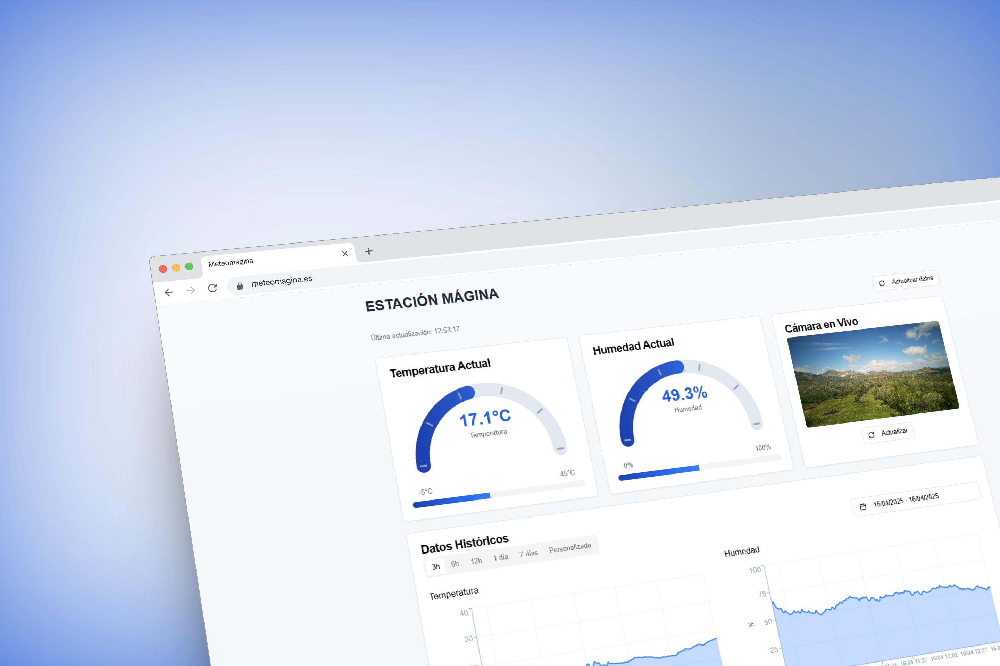
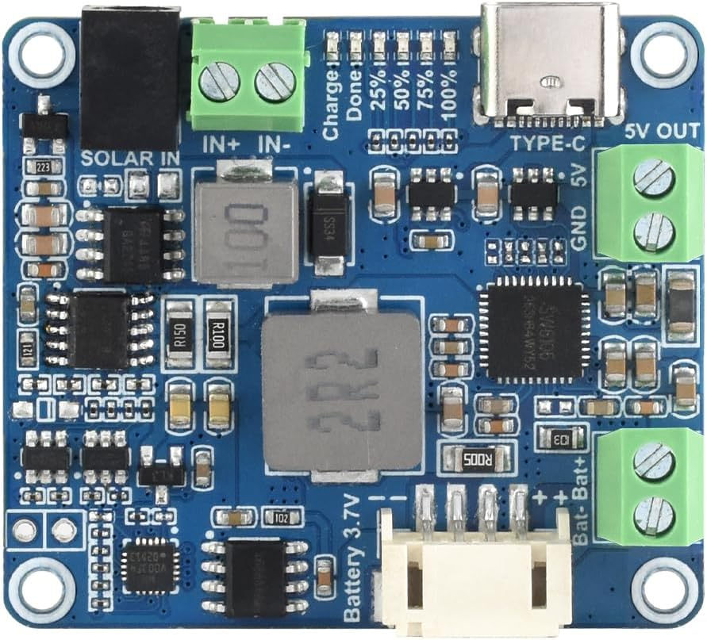

## 🎯 Objetivo

AeroCast nace para monitorizar condiciones ambientales en entornos aislados, donde no hay infraestructura local. Con este proyecto se pretende:

- **Registrar** temperatura y humedad con precisión profesional.
- **Capturar** imágenes periódicas de la ubicación remota para supervisión visual.
- **Garantizar autonomía** mediante energía solar, baterías y gestión inteligente.
- **Ofrecer supervisión avanzada** con dashboards en Grafana para uso interno.
- **Compartir datos** y gráficos históricos públicamente en un portal web.

Esta solución combina hardware abierto, software libre y conectividad 4G para facilitar despliegues en alta montaña y zonas remotas.

---

## 🌡️ Sensores Ambientales

  

1. **Temperatura & Humedad**  
   - Sensor **SHT35** con alta resolución.  
2. **Monitorización de Batería**  
   - Módulo **INA219** en bus I2C mide voltaje, corriente y consumo, generando métricas de autonomía.

Estas lecturas se transmiten mediante MQTT al backend para almacenamiento y visualización.

---

## 📷 Captura de Imágenes

  

- Se toma **una foto cada 5 min** con la cámara Full HD  
- Las instantáneas se suben al servidor y al dashboard para crear un histórico visual.  
- Ideal para seguimiento de cambios en el entorno: nieve, vegetación, fauna.

---

## 🔋 Alimentación Autónoma

  

- **Panel Solar 30 W** para carga diaria incluso con luz tenue.  
- **Batería Li-ion 40 Ah (3.7 V)**, con suficientes ciclos para varios días en mal tiempo.  
- **Gestión energética** con INA219 y protecciones (diodos y regulador) y un controlador mppt

Permite operación continua sin mantenimiento frecuente.

---

## 📡 Conectividad 4G

  

- **Waveshare 4G LTE Hat** instalado en Raspberry Pi.  
- Envío periódico de datos y fotos por red celular.  
- Configuración remota de APN y umbrales de envío para optimizar costes.

Esta capa asegura alcance global y redundancia en conexión.

---

## 🖥️ Supervisión & Dashboards

  

- **Grafana** se utiliza para supervisión interna:  
  - Paneles con temperatura, humedad y estado de batería en tiempo real.  
  - Alertas configurables al caer parámetros por debajo de umbrales.

- **Portal Público** en https://meteomagina.es:  
  - Gráficas históricas de temperatura y humedad accesibles a todos.  
  - Galería de las últimas imágenes capturadas automáticamente.

---

## 🛠️ Arquitectura & Software

1. **Hardware:** Raspberry Pi cero 2w + sensores I2C + cámara Full HD + módem 4G.  
2. **Backend:** Python 3 + Flask + MQTT.
3. **Base de datos:** Influxdb para métricas.  
4. **Visualización:**  
   - **Grafana** para dashboards internos.  
   - **React + Chart.js** en portal público (`meteomagina.es`).

La modularidad permite añadir sensores, migrar DB o integrar nuevos servicios.

---

## 📸 Galería

  
  
  
  

> Sustituye las imágenes de `assets/` con tus propias capturas para actualizar la galería.

---

## 📄 Licencia

MIT © Juan Moreno De La Casa

---

## ✉️ Contacto

- **Autor:** Juan Moreno De La Casa  
- **Email:** [usuariojuanito@gmail.com](mailto:usuariojuanito@gmail.com)  
- **Repo GitHub:** [AeroCast](https://github.com/JuanMorenoDeLaCasa/AeroCast)

