# 🌤️ AeroCast — Remote Environmental Monitoring Station

<p align="center">
  
  
  
  
  
  
  
  <!-- TODO: add Live Demo badge once the web is public -->
</p>

> **AeroCast** is an autonomous environmental and photographic monitoring station powered by solar energy, connected via 4G, and managed remotely from a home Raspberry Pi that acts as web server, time-series database, and daily timelapse generator.

<p align="center">
  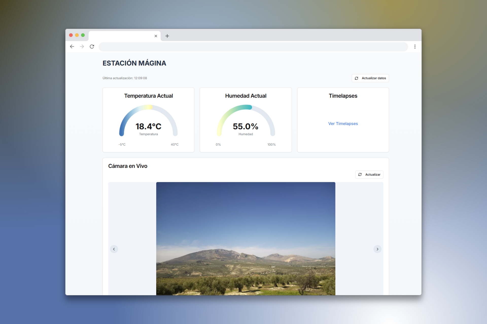
</p>

---

## 📋 Table of Contents

1. [Overview](#-overview)
2. [System Architecture](#-system-architecture)
3. [Hardware](#-hardware)
4. [Software & Dependencies](#-software--dependencies)
5. [Project Structure](#-project-structure)
6. [Core Components](#-core-components)
   - [station.py — Field Script](#stationpy--field-script-raspberry-pi-zero-2w)
   - [timelapse.sh — Timelapse Generator](#timelapsesh--timelapse-generator)
   - [clean_old_photos.sh — Storage Cleanup](#clean_old_photossh--storage-cleanup)
7. [Data Flow](#-data-flow)
8. [Setup & Deployment](#-setup--deployment)
   - [Raspberry Pi Zero 2W (field)](#raspberry-pi-zero-2w-field)
   - [Raspberry Pi 4 (home server)](#raspberry-pi-4-home-server)
9. [Environment Variables & Configuration](#-environment-variables--configuration)
10. [InfluxDB Database](#-influxdb-database)
11. [Grafana Dashboard](#-grafana-dashboard)
12. [Next.js Web App](#-nextjs-web-app)
    - [Tech Stack](#tech-stack)
    - [app/ folder structure](#app-folder-structure)
    - [Pages](#pages)
    - [API Routes](#api-routes)
    - [Web server environment variables](#web-server-environment-variables)
    - [Visual theme & styles](#visual-theme--styles)
    - [Components (components/)](#components-components)
    - [Utility library (lib/)](#utility-library-lib)
13. [Cron Jobs](#-cron-jobs)
14. [Solar Energy System](#-solar-energy-system)
15. [VE.Direct Protocol (Victron)](#-vedirect-protocol-victron)
16. [4G Connectivity — SIM7600G-H](#-4g-connectivity--sim7600g-h)
17. [Resilience & Self-Recovery](#-resilience--self-recovery)
18. [Roadmap](#-roadmap)
19. [License](#-license)

---

## 🌍 Overview

AeroCast is a personal project built to continuously and autonomously monitor environmental conditions at a remote outdoor location. The station captures data every 2 minutes and transmits it to a home server where it is stored, visualised, and published on a public website.

**Key capabilities:**

- 📸 High-resolution photo capture every 2 minutes (4656 × 3496 px)
- 🌡️ Outdoor temperature & humidity measurement (SHT35) and enclosure interior monitoring (DHT22)
- 🔋 Solar energy system telemetry: battery voltage, panel voltage, charge current and power (Victron MPPT via VE.Direct)
- 🌡️ Pi Zero 2W CPU temperature monitoring
- 🎬 Automatic daily timelapse video generated from all photos of the day
- 📡 4G connectivity via SIM7600G-H modem with automatic self-recovery on signal loss
- ☀️ Fully autonomous power supply via solar panel, battery, and MPPT charge controller
- 📦 All hardware housed in an IP65+ weatherproof outdoor enclosure

---

## 🏗️ System Architecture

```
┌─────────────────────────────────────────────────────────────────────┐
│                     FIELD STATION (Weatherproof enclosure)           │
│                                                                       │
│  ┌──────────────┐    I²C     ┌──────────┐                            │
│  │  SHT35       │───────────▶│          │                            │
│  │  (outdoor    │            │  RPi     │   USB Serial   ┌─────────┐ │
│  │   T° & RH)   │            │  Zero    │───────────────▶│ Victron │ │
│  └──────────────┘            │  2W      │                │  MPPT   │ │
│                              │          │   USB Serial   └────┬────┘ │
│  ┌──────────────┐    GPIO    │ station  │───────────────▶┌─────────┐ │
│  │  DHT22       │───────────▶│  .py     │                │SIM7600  │ │
│  │  (enclosure  │            │          │                │G-H 4G   │ │
│  │   T° & RH)   │            │          │                └────┬────┘ │
│  └──────────────┘            │          │                     │      │
│                              │          │◀── CSI ──┐          │      │
│  ┌──────────────┐            └──────────┘    ┌─────┴───┐      │      │
│  │  Solar panel │──┐                         │ Camera  │      │      │
│  │  + Battery   │  │                         │ HQ/V3   │      │      │
│  └──────────────┘  │                         └─────────┘      │      │
│                    ▼                                           │      │
│            ┌──────────────┐                                   │      │
│            │ Victron MPPT │                                   │      │
│            └──────────────┘                                   │      │
└────────────────────────────────────────────────────────────── │ ─────┘
                                                                │
                                4G / Internet ◀─────────────────┘
                                                │
┌───────────────────────────────────────────────▼────────────────────┐
│                    HOME SERVER (RPi 4 — 24/7)                        │
│                                                                       │
│  ┌──────────────┐   ┌──────────────┐   ┌──────────────────────────┐  │
│  │  InfluxDB    │   │   Grafana    │   │   Next.js Web App        │  │
│  │  2.x         │◀──│   Dashboard  │   │   (live photos,          │  │
│  │  (Sensores)  │   │              │   │    timelapses, data)     │  │
│  └──────────────┘   └──────────────┘   └──────────────────────────┘  │
│                                                                       │
│  /storage/                                                            │
│  ├── foto.jpg / foto.webp     ← latest live photo                    │
│  ├── fotos/                   ← JPG history (≤24h)                   │
│  │   └── webp/                ← WebP history (≤24h)                  │
│  └── timelapses/              ← daily MP4 videos                     │
│      └── thumbnails/          ← timelapse thumbnails                 │
└───────────────────────────────────────────────────────────────────────┘
```

<p align="center">
  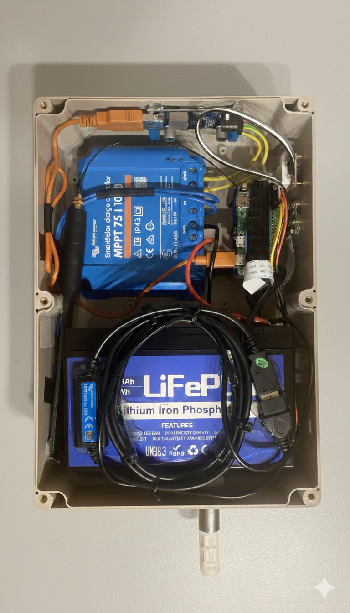
  <br/>
  <em>Inside the weatherproof enclosure — RPi Zero 2W, SIM7600G-H modem, Victron MPPT and sensors</em>
</p>

---

## 🔧 Hardware

### Field Station

| Component | Model / Detail |
|---|---|
| Microcontroller | Raspberry Pi Zero 2W |
| Camera | Raspberry Pi Camera Module (CSI), max resolution 4656×3496 px |
| Outdoor sensor | SHT35 (temperature + humidity, I²C) |
| Indoor sensor | DHT22 (temperature + humidity, GPIO 4) |
| 4G Modem | SIM7600G-H (USB, AT commands) |
| Solar controller | Victron SmartSolar MPPT (VE.Direct USB) |
| Solar panel | Photovoltaic panel (W capacity depends on site) |
| Battery | Deep-cycle battery (LiFePO4 / AGM) |
| Enclosure | Outdoor weatherproof case (IP65 or higher) |

<table>
  <tr>
    <td align="center">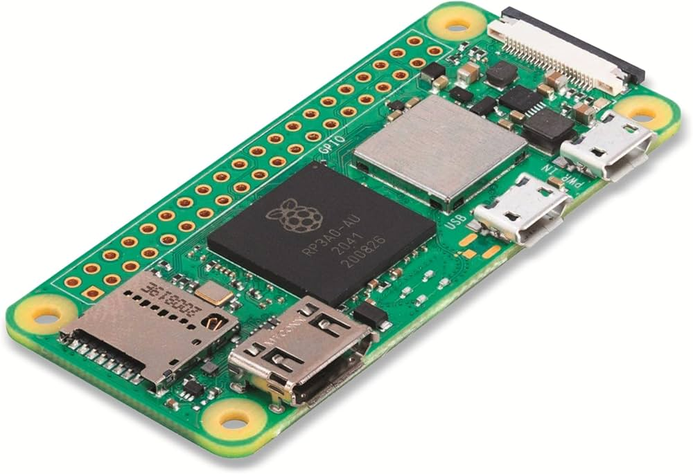<br/><em>Raspberry Pi Zero 2W</em></td>
    <td align="center">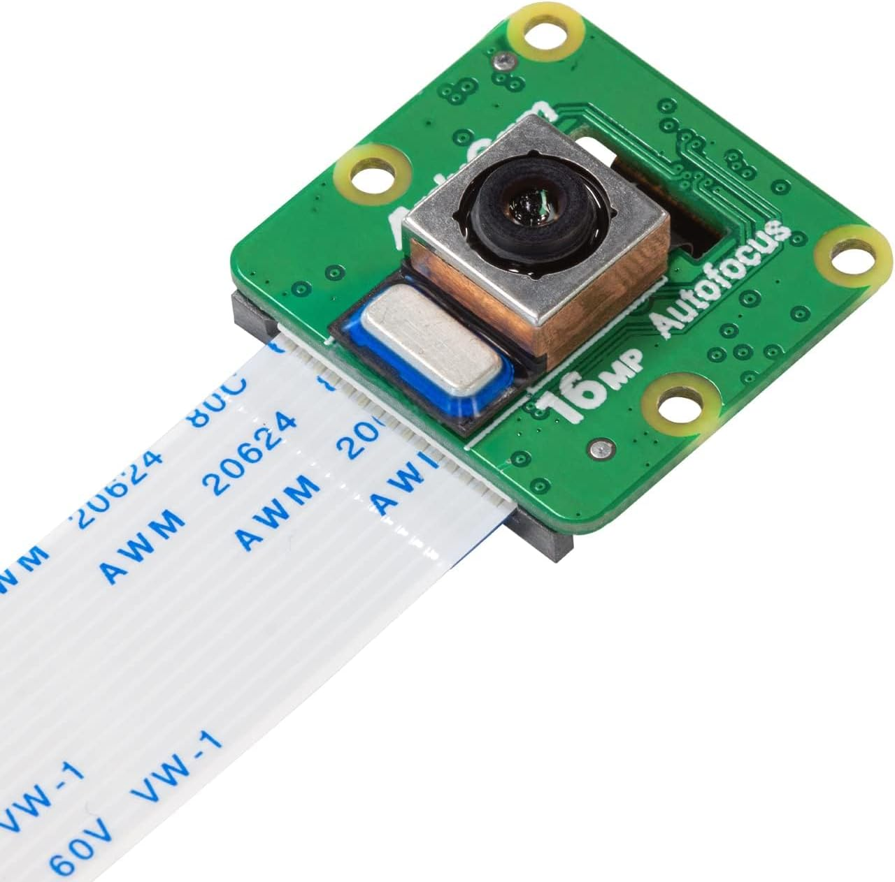<br/><em>Arducam 16MP Camera</em></td>
    <td align="center">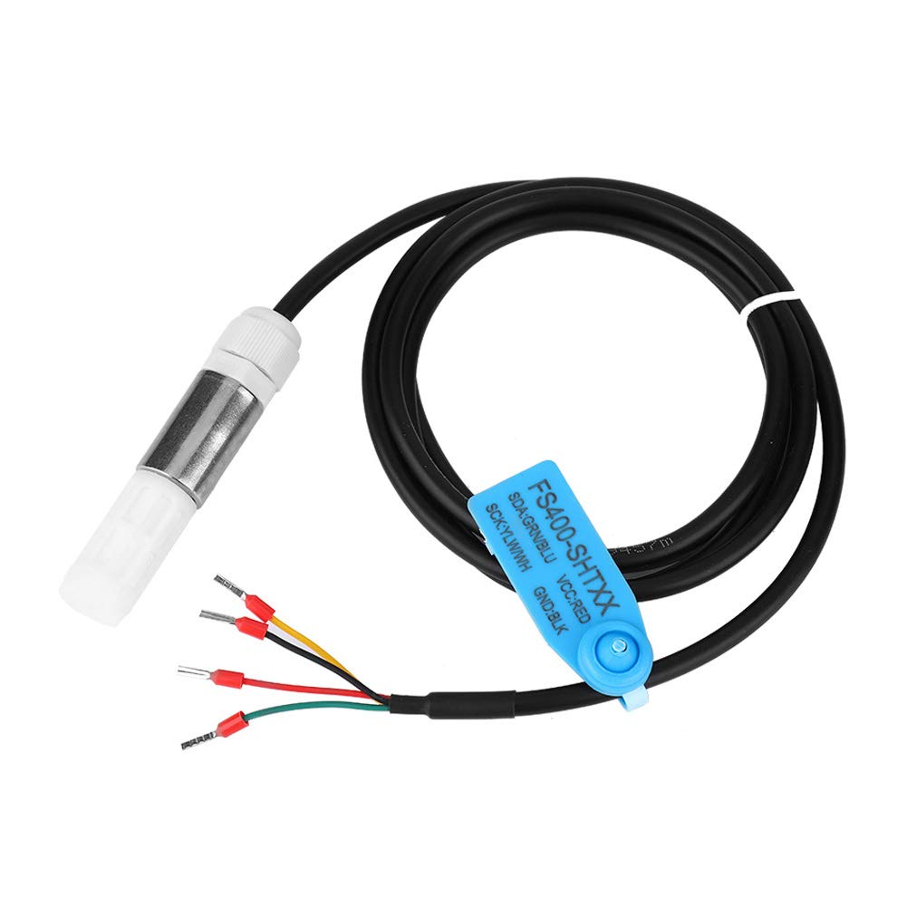<br/><em>SHT35 Temp & Humidity Sensor</em></td>
  </tr>
  <tr>
    <td align="center">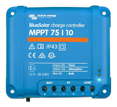<br/><em>Victron SmartSolar MPPT 75/10</em></td>
    <td align="center">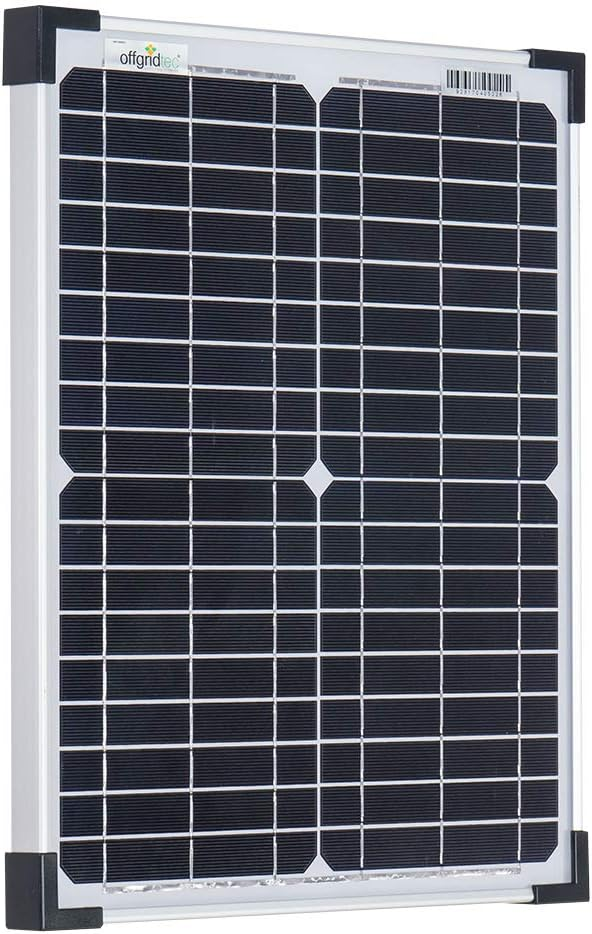<br/><em>20W Solar Panel</em></td>
    <td align="center">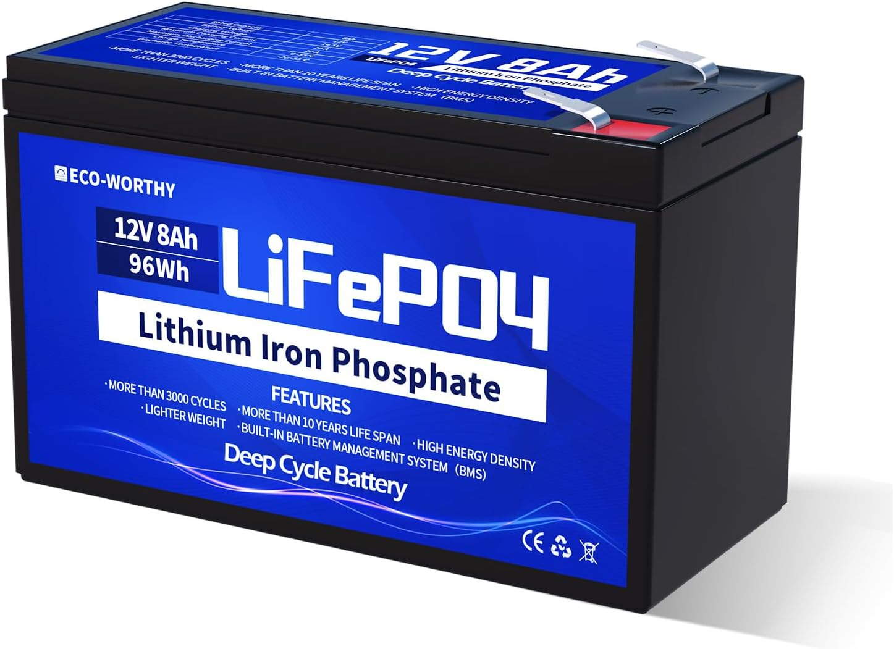<br/><em>8Ah LiFePO4 Battery</em></td>
  </tr>
  <tr>
    <td align="center">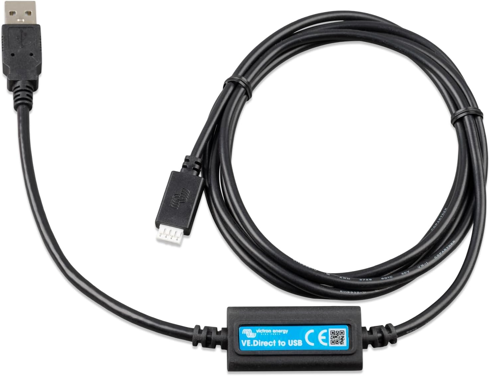<br/><em>VE.Direct USB Cable</em></td>
    <td></td>
    <td></td>
  </tr>
</table>

### Home Server

| Component | Detail |
|---|---|
| Server | Raspberry Pi 4 |
| Storage | MicroSD or external SSD |
| Connectivity | Ethernet / home Wi-Fi |
| Services | InfluxDB 2.x, Grafana, Next.js (Node.js) |

<p align="center">
  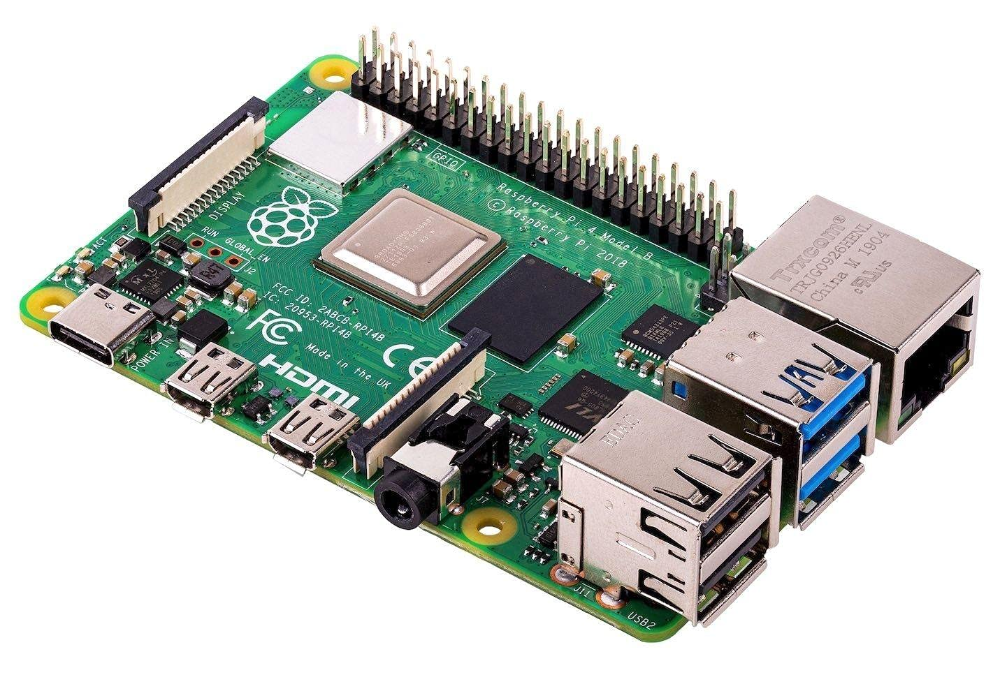
  <br/>
  <em>Raspberry Pi 4 — home server running 24/7</em>
</p>

---

## 💻 Software & Dependencies

### Raspberry Pi Zero 2W (field)

```
Raspberry Pi OS Lite (64-bit recommended)
Python 3.11+
```

**Python packages:**

```
influxdb-client
adafruit-circuitpython-sht31d
adafruit-blinka
Adafruit_DHT
Pillow
pyserial
```

**System tools:**

```
libcamera-still     # Image capture
vcgencmd            # CPU temperature
scp / ssh           # Secure file transfer
```

### Raspberry Pi 4 (server)

```
Raspberry Pi OS / Debian
Node.js 18+
npm / pnpm
InfluxDB 2.x
Grafana
ffmpeg              # Timelapse and thumbnail generation
```

---

## 📁 Project Structure

```
aerocast/
│
├── 📂 field/                           # Code running on the Pi Zero 2W
│   └── station.py                      # Main telemetry and photo script
│
├── 📂 server/                          # Scripts running on the Pi 4
│   ├── timelapse.sh                    # Generates the daily timelapse
│   └── clean_old_photos.sh             # Removes photos older than 24h
│
├── 📂 web/                             # Next.js web application
│   ├── app/                            # Next.js App Router
│   ├── components/                     # React components
│   ├── lib/                            # InfluxDB client and utilities
│   ├── storage/                        # Image and video storage
│   │   ├── foto.jpg                    # Latest photo (live)
│   │   ├── foto.webp                   # Latest optimised photo (live)
│   │   ├── fotos/                      # JPG history (last 24h)
│   │   │   └── webp/                   # WebP history (last 24h)
│   │   └── timelapses/                 # Daily MP4 videos
│   │       └── thumbnails/             # Timelapse thumbnails
│   └── package.json
│
└── README.md
```

---

## 🧩 Core Components

### `station.py` — Field Script (Raspberry Pi Zero 2W)

This is the heart of the station. It runs every **2 minutes** via `cron` as a single-shot process and executes the following sequence:

1. **SIM7600G-H modem initialisation** via USB serial, sending AT commands to verify communication and power up the radio (`AT+CFUN=1`).
2. **Internet connectivity check** by pinging multiple hosts (`8.8.8.8`, `1.1.1.1`, home server). If all fail after 3 retries, the system triggers an automatic reboot.
3. **SHT35 sensor reading** (outdoor temperature and humidity) via I²C.
4. **DHT22 sensor reading** (enclosure interior temperature and humidity) via GPIO with up to 15 retries to ensure a valid reading.
5. **CPU temperature reading** using `vcgencmd measure_temp`.
6. **Victron MPPT reading** via VE.Direct protocol (USB serial), retrieving battery voltage, charge current, panel voltage, power output, and charge state.
7. **Photo capture** with `libcamera-still` at full resolution 4656×3496 px, with manual focus, auto white balance, and fast noise reduction.
8. **Image transfer to server** via SCP in two formats:
   - **Original JPG** → `foto.jpg` (live) and `fotos/YYYY-MM-DD-HH-MM.jpg` (history)
   - **Resized WebP** at 800px width → `foto.webp` (live) and `fotos/webp/YYYY-MM-DD-HH-MM.webp` (history)
9. **InfluxDB write** with all sensor and energy data to the `Sensores` bucket.
10. **Radio shutdown** (`AT+CFUN=0`) to reduce power consumption between cycles.

#### Data collected and written to InfluxDB

| InfluxDB field | Sensor | Unit |
|---|---|---|
| `temperatura_exterior_C` | SHT35 | °C |
| `humedad_exterior_pct` | SHT35 | % |
| `temperatura_interior_C` | DHT22 | °C |
| `humedad_interior_pct` | DHT22 | % |
| `temperatura_cpu_C` | `vcgencmd` | °C |
| `bateria_V` | Victron MPPT | V |
| `corriente_A` | Victron MPPT | A |
| `panel_V` | Victron MPPT | V |
| `potencia_W` | Victron MPPT | W |
| `estado_carga` | Victron MPPT | CS code |

#### Configuration snippet (`station.py`)

```python
DHT_PIN_BCM = 4           # GPIO pin for the DHT22
DHT_SENSOR  = Adafruit_DHT.DHT22

# Victron VE.Direct port (persistent USB ID)
VE_DIRECT_PORT = "/dev/serial/by-id/usb-VictronEnergy_BV_VE_Direct_cable_..."
VE_BAUDRATE = 19200

# SIM7600G-H AT port (persistent USB ID)
MODEM_PORT = "/dev/serial/by-id/usb-SimTech__Incorporated_..."
MODEM_BAUDRATE = 115200

# InfluxDB
INFLUX_URL    = "http://server:8086"
INFLUX_TOKEN  = "<your_token>"
INFLUX_ORG    = "AeroCast"
INFLUX_BUCKET = "Sensores"

# Next.js server (SCP destination)
SERVIDOR_USUARIO = "juanmoreno"
SERVIDOR_IP      = "server"
SERVIDOR_RUTA    = "/home/juanmoreno/weather-station/storage/"
```

> ⚠️ **Important:** Tokens and device paths must be adapted to each installation. It is strongly recommended to use environment variables or a `.env` file for sensitive credentials.

---

### `timelapse.sh` — Timelapse Generator

Runs automatically every night at **00:00** via cron. It takes all JPG photos accumulated during the day in `storage/fotos/` and produces an MP4 timelapse video for that date.

**Process:**

1. Feeds all `.jpg` files in the photos directory to `ffmpeg` using `pattern_type glob`.
2. Generates a video at **15 fps**, scaled to **1440px height** (width auto-adjusted), compressed with `libx264` at CRF 18 (high quality).
3. If the video is longer than **12 seconds**, the thumbnail is extracted at second 10. Otherwise, the middle frame is used.
4. Saves the thumbnail to `timelapses/thumbnails/YYYY-MM-DD.jpg` resized to 640px wide.

**ffmpeg parameters:**

```bash
ffmpeg -y \
  -framerate 15 \
  -pattern_type glob \
  -i "$INPUT_DIR/*.jpg" \
  -vf "scale=-2:1440" \
  -c:v libx264 \
  -pix_fmt yuv420p \
  -crf 18 \
  -preset superfast \
  "$OUTPUT_FILE"
```

| Parameter | Value | Description |
|---|---|---|
| `-framerate` | 15 | Frames per second of the timelapse |
| `scale=-2:1440` | — | Fixed height 1440px, width auto-adjusted |
| `-crf` | 18 | High quality (0=lossless, 51=worst) |
| `-preset` | superfast | Speed/compression balance optimised for RPi |

---

### `clean_old_photos.sh` — Storage Cleanup

Maintenance script that deletes photos **older than 24 hours** (1440 minutes) in both JPG and WebP formats. This prevents the Raspberry Pi 4 storage from filling up over time, since the daily timelapse videos already preserve the full visual record of each day.

```bash
# Delete JPGs older than 24h
find "$FOTOS_JPG_DIR" -type f -name "*.jpg" -mmin +1440 -exec rm {} \;

# Delete WebPs older than 24h
find "$FOTOS_WEBP_DIR" -type f -name "*.webp" -mmin +1440 -exec rm {} \;
```

Runs daily via cron, ideally **after** `timelapse.sh` has finished (e.g. at 00:30).

---

## 🔄 Data Flow

```
Every 2 minutes (cron on RPi Zero 2W):
─────────────────────────────────────────────────────────────────────────

  [SIM7600G-H Modem]
       │ AT+CFUN=1 → power up radio
       │ ping      → verify internet
       ▼
  [Sensors]
       │ SHT35 (I²C) ──────────────────────────────────────────┐
       │ DHT22 (GPIO 4) ────────────────────────────────────────┤
       │ vcgencmd (CPU) ────────────────────────────────────────┤
       │ Victron MPPT (VE.Direct serial) ──────────────────────┤
       ▼                                                         │
  [CSI Camera]                                                   │
       │ libcamera-still (4656×3496)                            │
       │ → fto.jpg                                              │
       ▼                                                         ▼
  [Pillow]                                               [InfluxDB Client]
       │ resize → 800px wide                                     │
       │ convert → .webp                                         │
       ▼                                                         ▼
  [SCP → RPi 4]                                         [InfluxDB 2.x]
       ├── storage/foto.jpg           (live)             bucket: Sensores
       ├── storage/foto.webp          (live)
       ├── storage/fotos/TIMESTAMP.jpg     (history)
       └── storage/fotos/webp/TIMESTAMP.webp (history)

  [Modem]
       └── AT+CFUN=0 → power down radio (energy saving)


Every day at 00:00 (cron on RPi 4):
─────────────────────────────────────────────────────────────────────────

  [timelapse.sh]
       │ ffmpeg glob ← storage/fotos/*.jpg
       │ → storage/timelapses/YYYY-MM-DD.mp4
       └── ffmpeg  → storage/timelapses/thumbnails/YYYY-MM-DD.jpg

  [clean_old_photos.sh] (00:30)
       ├── find + rm → fotos/*.jpg       (>24h)
       └── find + rm → fotos/webp/*.webp (>24h)
```

---

## ⚙️ Setup & Deployment

### Raspberry Pi Zero 2W (field)

#### 1. Prepare the operating system

```bash
# Use Raspberry Pi Imager with Raspberry Pi OS Lite (64-bit)
# Enable SSH, set username and hostname before writing the image
```

#### 2. Install system dependencies

```bash
sudo apt update && sudo apt upgrade -y
sudo apt install -y python3-pip python3-venv libcamera-apps \
  libgpiod2 i2c-tools git scp
```

#### 3. Enable interfaces

```bash
# Enable I²C (for SHT35) and CSI camera
sudo raspi-config
# → Interface Options → I2C → Enable
# → Interface Options → Camera → Enable
```

#### 4. Install Python dependencies

```bash
pip3 install \
  influxdb-client \
  adafruit-circuitpython-sht31d \
  adafruit-blinka \
  Adafruit_DHT \
  Pillow \
  pyserial
```

#### 5. Set up passwordless SSH to the server

```bash
# Generate SSH key on the Pi Zero 2W (if not already present)
ssh-keygen -t ed25519 -C "aerocast-field"

# Copy the public key to the home server (Pi 4)
ssh-copy-id juanmoreno@<SERVER_IP>
```

#### 6. Configure cron

```bash
crontab -e
```

```cron
# Run station.py every 2 minutes
*/2 * * * * /usr/bin/python3 /home/pi/station.py >> /home/pi/logs/station.log 2>&1
```

#### 7. Identify persistent serial ports

```bash
# Plug in the USB devices and list by ID
ls /dev/serial/by-id/

# Update VE_DIRECT_PORT and MODEM_PORT in station.py
# with the paths shown for the VE.Direct cable and the modem
```

---

### Raspberry Pi 4 (home server)

#### 1. Install InfluxDB 2.x

```bash
wget -q https://repos.influxdata.com/influxdata-archive_compat.key
echo '393e8779c89ac8d958f81f942f9ad7fb82a25e133faddaf92e15b16e6ac9ce4c influxdata-archive_compat.key' | sha256sum -c
cat influxdata-archive_compat.key | gpg --dearmor | \
  sudo tee /etc/apt/trusted.gpg.d/influxdata-archive_compat.gpg > /dev/null

echo 'deb [signed-by=/etc/apt/trusted.gpg.d/influxdata-archive_compat.gpg] https://repos.influxdata.com/debian stable main' | \
  sudo tee /etc/apt/sources.list.d/influxdata.list

sudo apt update && sudo apt install influxdb2 -y
sudo systemctl enable --now influxdb
```

#### 2. Install Grafana

```bash
sudo apt install -y adduser libfontconfig1 musl
wget https://dl.grafana.com/oss/release/grafana-rpi_<version>_armhf.deb
sudo dpkg -i grafana-rpi_<version>_armhf.deb
sudo systemctl enable --now grafana-server
```

#### 3. Install Node.js and set up Next.js

```bash
curl -fsSL https://deb.nodesource.com/setup_18.x | sudo -E bash -
sudo apt install -y nodejs
cd /home/juanmoreno/weather-station
npm install
npm run build
# Start with PM2 for continuous background execution
npm install -g pm2
pm2 start npm --name "aerocast-web" -- start
pm2 save && pm2 startup
```

#### 4. Install ffmpeg

```bash
sudo apt install -y ffmpeg
```

#### 5. Create directory structure

```bash
mkdir -p /home/juanmoreno/weather-station/storage/fotos/webp
mkdir -p /home/juanmoreno/weather-station/storage/timelapses/thumbnails
```

#### 6. Configure cron on the server

```bash
crontab -e
```

```cron
# Generate timelapse every day at midnight
0 0 * * * /home/juanmoreno/timelapse.sh >> /home/juanmoreno/logs/timelapse.log 2>&1

# Clean old photos at 00:30
30 0 * * * /home/juanmoreno/clean_old_photos.sh >> /home/juanmoreno/logs/clean.log 2>&1
```

---

## 🔐 Environment Variables & Configuration

It is recommended not to hardcode credentials in `station.py`. A safer approach is to use a `.env` file loaded at startup:

```bash
# /home/pi/.env.aerocast
INFLUX_TOKEN=your_token_here
SERVIDOR_USUARIO=juanmoreno
SERVIDOR_IP=192.168.1.X
```

```python
# At the top of station.py
from dotenv import load_dotenv
import os
load_dotenv("/home/pi/.env.aerocast")
INFLUX_TOKEN = os.getenv("INFLUX_TOKEN")
```

---

## 🗄️ InfluxDB Database

### Measurement: `sensors`

**Tags:**

| Tag | Example value |
|---|---|
| `host` | `raspberrypi` |

**Fields:**

| Field | Type | Description |
|---|---|---|
| `temperatura_exterior_C` | float | Outdoor temperature (SHT35) in °C |
| `humedad_exterior_pct` | float | Outdoor humidity (SHT35) in % |
| `temperatura_interior_C` | float | Enclosure interior temperature (DHT22) in °C |
| `humedad_interior_pct` | float | Enclosure interior humidity (DHT22) in % |
| `temperatura_cpu_C` | float | Pi Zero 2W CPU temperature in °C |
| `bateria_V` | float | Battery voltage in V |
| `corriente_A` | float | Charge current in A |
| `panel_V` | float | Solar panel voltage in V |
| `potencia_W` | int | Solar panel power output in W |
| `estado_carga` | int | Victron charge state code (CS) |

**Example Flux query — outdoor temperature over the last 24h:**

```flux
from(bucket: "Sensores")
  |> range(start: -24h)
  |> filter(fn: (r) => r._measurement == "sensors")
  |> filter(fn: (r) => r._field == "temperatura_exterior_C")
  |> aggregateWindow(every: 10m, fn: mean, createEmpty: false)
```

### Victron Charge State Codes (CS)

| Code | Meaning |
|---|---|
| 0 | Off |
| 2 | Fault |
| 3 | Bulk (fast charge) |
| 4 | Absorption |
| 5 | Float (maintenance) |
| 7 | Equalize Manual |
| 245 | Starting-up |
| 247 | Auto Equalize |

---

## 📊 Grafana Dashboard

The Grafana dashboard connects to InfluxDB 2.x using the official Flux data source. Recommended panels:

- **Outdoor vs indoor temperature** — dual time-series line chart
- **Outdoor vs indoor humidity** — area chart
- **Battery voltage** — line chart with alert threshold (e.g. <11.5V)
- **Solar panel power** — hourly bar chart
- **MPPT charge state** — stat panel with colour-coded states
- **CPU temperature** — gauge with colour ranges
- **Energy generated today** — derived field calculated from `potencia_W`

**Data source configuration:**

```
URL:              http://localhost:8086
Organization:     AeroCast
Token:            <influx_token>
Default Bucket:   Sensores
```

<p align="center">
  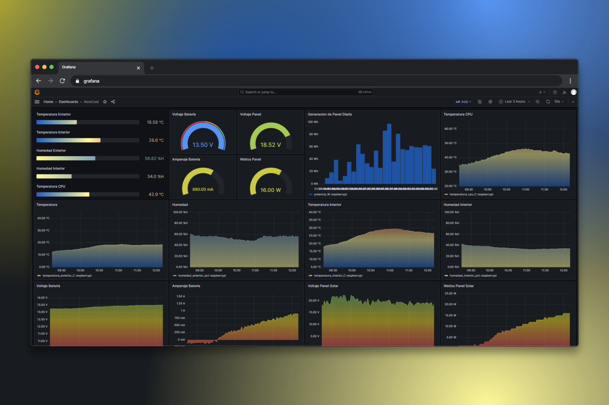
  <br/>
  <em>Grafana dashboard — energy system and environmental data</em>
</p>

---

## 🌐 Next.js Web App

The web interface is named **Estación Mágina** and is built with **Next.js** (App Router), **Tailwind CSS**, and **shadcn/ui**. It runs continuously on the Raspberry Pi 4 via **PM2** and serves as the public frontend of the entire system, querying data from InfluxDB and serving images and videos directly from the local filesystem.

### Tech Stack

| Technology | Purpose |
|---|---|
| Next.js (App Router) | React framework with SSR and built-in API routes |
| Tailwind CSS | Utility-first styling |
| shadcn/ui | UI components (Card, Alert, Skeleton, etc.) |
| Inter (Google Fonts) | Primary typeface |
| lucide-react | Icon set |
| Recharts | Interactive charts |
| date-fns | Date formatting and manipulation |
| next-themes | Light/dark theme management |
| InfluxDB Client | Server-side data queries |

### `app/` folder structure

```
app/
├── layout.tsx                    # Root layout — metadata, Inter font, favicon
├── page.tsx                      # Home page → Dashboard with Suspense
├── globals.css                   # CSS variables (light/dark theme), Tailwind
│
├── timelapses/
│   └── page.tsx                  # Timelapse gallery with video playback modal
│
└── api/
    ├── current-data/
    │   └── route.ts              # GET  — latest sensor data from InfluxDB
    ├── historical-data/
    │   └── route.ts              # POST — time-series data for a date range
    ├── influxdb-config/
    │   └── route.ts              # GET  — InfluxDB configuration status
    ├── test-influxdb/
    │   └── route.ts              # POST — write test data to InfluxDB
    ├── fotos/
    │   ├── route.ts              # GET  — list of available photos (JPG + WebP)
    │   └── [filename]/
    │       └── route.ts          # GET  — serve an individual photo by filename
    ├── timelapses/
    │   └── route.ts              # GET  — list of available MP4 timelapse videos
    ├── timelapse/
    │   └── [filename]/
    │       └── route.ts          # GET  — video streaming with Range request support
    └── thumbnail/
        └── [filename]/
            └── route.ts          # GET  — serve timelapse thumbnails
```

### Pages

#### `/` — Main dashboard (`app/page.tsx`)

Application entry point. Renders the `<Dashboard />` component wrapped in a React `<Suspense>` boundary with a loading skeleton (`<DashboardSkeleton />`), making the page immediately interactive while InfluxDB data is fetched in the background.

```tsx
<main className="min-h-screen bg-gradient-to-b from-slate-50 to-slate-100 p-4 md:p-8">
  <h1 className="mb-8 text-3xl font-bold text-slate-800">ESTACIÓN MÁGINA</h1>
  <Suspense fallback={<DashboardSkeleton />}>
    <Dashboard />
  </Suspense>
</main>
```

The `Dashboard` component (in `components/dashboard.tsx`) is the visual core: it aggregates the live photo, sensor data, energy metrics, and photo history.

<p align="center">
  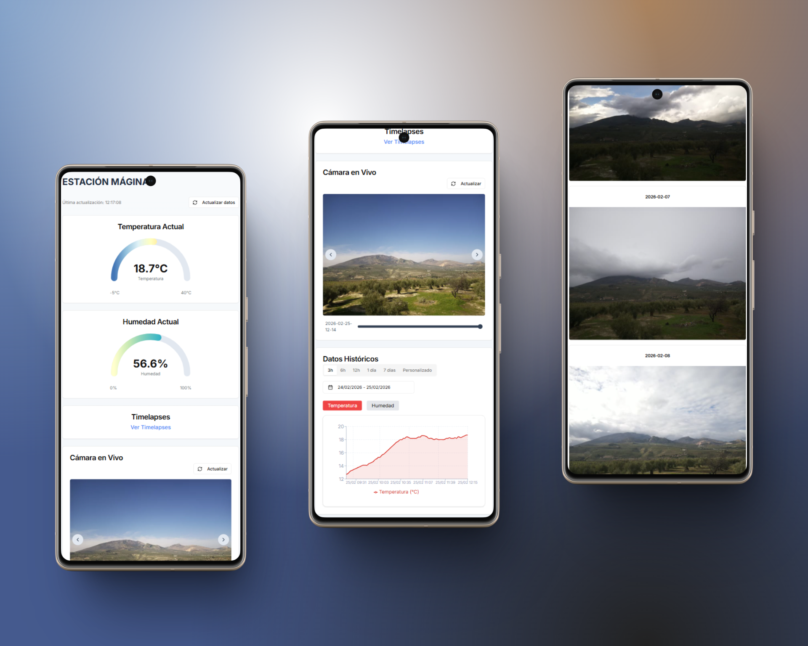
  <br/><em>Fully responsive — mobile view</em>
</p>

#### `/timelapses` — Timelapse gallery (`app/timelapses/page.tsx`)

Client component (`"use client"`) that fetches the list of available timelapses from `/api/timelapses` and displays them in a responsive grid (1 column on mobile, up to 4 on desktop).

**Features:**

- Cards with thumbnail, date label, and a hover overlay with a play button.
- Clicking a card opens a **playback modal** with the full MP4 video (`<video controls muted playsInline />`).
- The modal closes on the ✕ button or by clicking outside the content (detected with `useRef` and event target comparison).
- Full state management: loading, error (rendered as `<Alert variant="destructive">`), empty state, and populated grid.

<p align="center">
  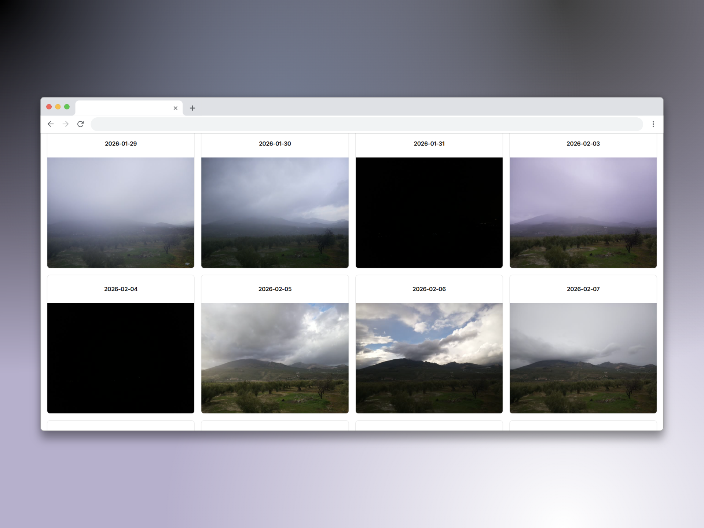
  <br/><em>Timelapse gallery — daily MP4 videos with auto-generated thumbnails</em>
</p>

### API Routes

All API routes live under `app/api/` and are handled by Next.js Route Handlers.

#### `GET /api/current-data`

Calls `fetchCurrentData()` from `@/lib/influxdb` and returns the latest sensor values as JSON. Consumed by the `Dashboard` component every 30 seconds.

```json
{
  "temperatura_exterior_C": 18.42,
  "humedad_exterior_pct": 61.5
}
```

#### `POST /api/historical-data`

Accepts a JSON body with `start` and `end` ISO dates and returns the time series for the requested range using `fetchHistoricalData()`. Used to render historical charts in the dashboard.

```json
{ "start": "2025-01-20T00:00:00Z", "end": "2025-01-20T23:59:59Z" }
```

#### `GET /api/influxdb-config`

Diagnostic endpoint that returns the configuration status of InfluxDB environment variables without exposing the token. Useful for debugging in production.

```json
{
  "isConfigured": true,
  "config": {
    "url": "Configured",
    "org": "Configured",
    "bucket": "Configured",
    "token": "Configured"
  }
}
```

#### `GET /api/fotos`

Reads the `storage/fotos/webp/` and `storage/fotos/` directories, sorts files by name (equivalent to chronological order given the `YYYY-MM-DD-HH-MM` naming format), and returns an array of objects with both format URLs. Also updates `storage/foto.webp` with the most recent image.

```json
{
  "photos": [
    { "webp": "/api/fotos/2025-01-20-10-00.webp", "jpg": "/api/fotos/2025-01-20-10-00.jpg" },
    { "webp": "/api/fotos/2025-01-20-10-02.webp", "jpg": "/api/fotos/2025-01-20-10-02.jpg" }
  ]
}
```

#### `GET /api/fotos/[filename]`

Serves an individual image directly from the filesystem. Distinguishes between JPG (`storage/fotos/`) and WebP (`storage/fotos/webp/`) by file extension. Includes a special case for `foto.webp` that serves the live image from `storage/foto.webp`.

| Extension | Source folder | Content-Type |
|---|---|---|
| `.jpg` | `storage/fotos/` | `image/jpeg` |
| `.webp` | `storage/fotos/webp/` | `image/webp` |

#### `GET /api/timelapses`

Reads `storage/timelapses/` and returns the list of available MP4 videos with metadata, including the video URL and the corresponding thumbnail URL.

```json
{
  "timelapses": [
    {
      "filename": "2025-01-20.mp4",
      "date": "2025-01-20",
      "url": "/api/timelapse/2025-01-20.mp4",
      "thumbnail": "/api/thumbnail/2025-01-20.jpg"
    }
  ]
}
```

#### `GET /api/timelapse/[filename]`

Serves an MP4 file with full **HTTP Range Request** support (`Range: bytes=...`). This is essential for the browser's `<video>` element to seek to any point in the video without downloading the entire file. Responds with `206 Partial Content` when a byte range is requested.

```
Client:  Range: bytes=0-1048575
Server:  206 Partial Content
         Content-Range: bytes 0-1048575/12345678
         Content-Length: 1048576
         Content-Type: video/mp4
```

#### `GET /api/thumbnail/[filename]`

Serves the JPG thumbnail for a given timelapse from `storage/timelapses/thumbnails/`.

### Web server environment variables

Create a `.env.local` file at the root of the Next.js project:

```bash
# .env.local
INFLUXDB_URL=http://localhost:8086
INFLUXDB_TOKEN=<your_influxdb_token>
INFLUXDB_ORG=AeroCast
INFLUXDB_BUCKET=Sensores
```

> ⚠️ Never commit `.env.local` to the repository. Add it to `.gitignore`.

### Visual theme & styles

The application supports **light and dark mode** via CSS variables defined in `globals.css` following the shadcn/ui convention. The theme is applied automatically based on the user's OS preference.

The dashboard layout uses a `from-slate-50 to-slate-100` gradient background with a `max-w-7xl` centred container, fully responsive via Tailwind's breakpoint classes.

### Metadata & PWA

`layout.tsx` defines complete application metadata for SEO and mobile compatibility:

```tsx
export const metadata: Metadata = {
  title: "Estación Mágina",
  description: "Estación meteorológica en el corazón de Sierra Mágina",
  icons: {
    icon: [/* favicon 16, 32, 192, 512 */],
    apple: "/apple-touch-icon.png",
  },
  manifest: "/site.webmanifest",   // Enables PWA installation
}
```

The `manifest` entry allows the web app to be installed as a **Progressive Web App (PWA)** on mobile and desktop, running like a native application.

### Components (`components/`)

```
components/
├── dashboard.tsx              # Root dashboard component (state orchestrator)
├── dashboard-skeleton.tsx     # Loading skeleton (animated placeholder)
├── webcam-stream.tsx          # Live photo viewer and history slider
├── chart-dashboard.tsx        # Combined Temp/Humidity chart with selector
├── temperature-chart.tsx      # Temperature area chart (Recharts)
├── humidity-chart.tsx         # Humidity area chart (Recharts)
├── temperature-gauge.tsx      # SVG semicircular temperature gauge
├── humidity-gauge.tsx         # SVG semicircular humidity gauge
├── date-range-picker.tsx      # Custom date range selector
└── theme-provider.tsx         # Light/dark theme provider (next-themes)
```

---

#### `dashboard.tsx` — Main orchestrator

The central component of the application (`"use client"`). Manages all global dashboard state and coordinates all API requests.

**State managed:**

| State | Type | Description |
|---|---|---|
| `currentData` | `CurrentData` | Latest outdoor temperature and humidity |
| `historicalData` | `any[]` | Time series data for the charts |
| `timeRange` | `string` | Active range: `3h`, `6h`, `12h`, `1d`, `7d`, `custom` |
| `dateRange` | `{from, to}` | Custom range from the DatePicker |
| `loading` | `boolean` | General loading state |
| `isHistoricalLoading` | `boolean` | Chart-specific loading state |
| `configError` | `boolean` | Whether InfluxDB is misconfigured |
| `lastUpdated` | `Date` | Timestamp of the last successful update |

**Lifecycle and effects:**

1. On mount, checks if InfluxDB is configured (`/api/influxdb-config`). If not, renders a destructive `<Alert>` listing which environment variables are missing.
2. If InfluxDB is OK, starts a **30-second** `setInterval` to auto-refresh current data.
3. When `timeRange` or `dateRange` changes, recalculates the date range and triggers `fetchHistoricalData`.
4. The "Refresh data" button simultaneously refreshes both current and historical data.

**Dashboard layout:**

```
┌─────────────────────────────────────────────────────────────────┐
│  Last updated: HH:MM:SS                  [Refresh data]         │
├─────────────────┬──────────────────┬───────────────────────────┤
│  Current        │  Current         │  🎬 View Timelapses        │
│  Temperature    │  Humidity        │  (link → /timelapses)     │
│  [SVG Gauge]    │  [SVG Gauge]     │                           │
├─────────────────┴──────────────────┴───────────────────────────┤
│  Live Camera                                                    │
│  [WebcamStream — 3-column span]                                 │
├─────────────────────────────────────────────────────────────────┤
│  Historical Data                                                │
│  [3h][6h][12h][1d][7d][Custom]           [DateRangePicker]     │
│  [ChartDashboard]                                               │
└─────────────────────────────────────────────────────────────────┘
```

---

#### `dashboard-skeleton.tsx` — Loading skeleton

Renders animated placeholder elements using shadcn/ui's `<Skeleton>` component, mirroring the exact layout of the live dashboard (gauges, webcam, charts, tabs) to prevent layout shift when data arrives. It is the `fallback` of the `<Suspense>` boundary in `page.tsx`.

---

#### `webcam-stream.tsx` — Live photo viewer and history slider

The most complex UI component. Combines a **live image viewer** with a **photo history player** driven by a scrubbing slider.

**Features:**

- Fetches the full list of available photos from `/api/fotos` on mount and auto-refreshes every **5 minutes**.
- Displays the photo at the active index with left/right navigation arrows.
- An `<input type="range">` allows fast scrubbing through the entire day's history, showing the timestamp of the active photo.
- Clicking the image opens a **modal** that loads the original JPG version (higher resolution) of the same photo.
- **Smart preloading**: navigating automatically preloads the 20 photos before and after the current index using `new Image()`, reducing perceived latency.
- Automatically jumps to the latest photo index when a new image is detected.

```
┌──────────────────────────────────────────────────────┐
│                     [Refresh button]                  │
│                                                      │
│  ◀  [    Active WebP image (max 80vh)          ]  ▶  │
│                                                      │
│  2025-01-20-10-34  [══════════════●═════════]        │
│  (timestamp)              (range slider)             │
└──────────────────────────────────────────────────────┘

On image click:
┌──────────────────────────────────────────────────────┐
│                  [JPG modal — full res]       [✕]    │
│  ┌────────────────────────────────────────────────┐  │
│  │        Original JPG image (90vw / 90vh)        │  │
│  └────────────────────────────────────────────────┘  │
└──────────────────────────────────────────────────────┘
```

---

#### `chart-dashboard.tsx` — Combined historical chart

A responsive Recharts area chart that toggles between temperature and humidity via two buttons. Implements a **dynamic Y-axis domain**: automatically calculates the min/max of the dataset with a 10% margin, preventing the chart from being squashed or overflowing regardless of the value range.

- Temperature → red area (`#d72b22`), 10% fill opacity
- Humidity → blue area (`#4376b6`), 10% fill opacity
- Smooth curves with `type="natural"` interpolation
- Null values are not bridged (`connectNulls={false}`) to represent data gaps correctly

<p align="center">
  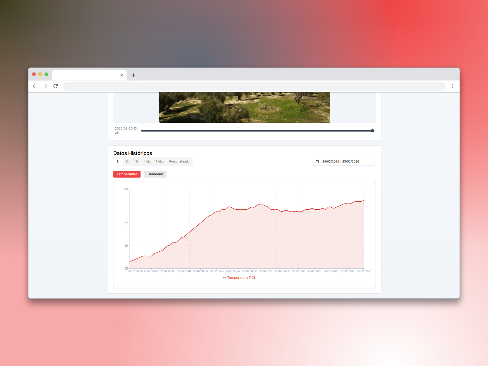
  <br/><em>Historical data chart — adaptive aggregation window based on selected time range</em>
</p>

---

#### `temperature-gauge.tsx` and `humidity-gauge.tsx` — SVG gauges

Semicircular gauges drawn in pure SVG with smooth animation. Both share the same architecture with different colour palettes.

**Technical mechanics:**

The arc is an SVG `<path>` with `strokeDasharray` and `strokeDashoffset`. As the value changes, the offset changes and the arc grows or shrinks visually. Colour is applied via a multi-stop `<linearGradient>` in `<defs>`.

The digit animation uses `requestAnimationFrame` to linearly interpolate from the previous to the new value over 1000ms, with no external animation library.

| Gauge | Range | Gradient |
|---|---|---|
| Temperature | -5°C → 40°C | Cold blue → white → warm red (7 stops) |
| Humidity | 0% → 100% | Yellow → cyan → deep blue (7 stops) |

```
Temperature gradient:
#4376b6 → #92c0dc → #e0f2f7 → #ffffc0 → #ffe392 → #fc8d57 → #d72b22
(cold)                          (neutral)                       (hot)

Humidity gradient:
#ffffcd → #c7e9b4 → #7fcdbb → #3fb8c5 → #1792c0 → #1c5ea9 → #042886
(dry)                                                            (very humid)
```

---

#### `temperature-chart.tsx` and `humidity-chart.tsx` — Individual charts

Standalone area chart components with custom tooltips showing values to one decimal place. The temperature Y-axis adapts dynamically to the data range. Both components filter out `null` / `undefined` points before rendering.

---

#### `date-range-picker.tsx` — Custom date range selector

Fully custom date picker built without using shadcn/ui's `PopoverContent` for greater positioning control. Implements its own popover positioned **above** the trigger (`bottom-full`) to avoid overflowing off-screen.

Uses **internal temporary state** (`fromTemp`, `toTemp`) so the user can pick both dates without triggering a chart re-render until "Apply" is clicked. If `from > to`, they are automatically swapped. Localised in Spanish via `date-fns/locale/es`.

---

#### `theme-provider.tsx` — Theme provider

A lightweight wrapper around `NextThemesProvider` from `next-themes`. Manages light/dark theme globally across the application, respecting the system preference and allowing a manual toggle to be added in the future.

---

### Utility library (`lib/`)

```
lib/
├── influxdb.js     # InfluxDB client: connection, queries and writes
└── utils.ts        # cn() helper for conditional Tailwind classes
```

---

#### `lib/influxdb.js` — Data access layer

The abstraction layer between InfluxDB and the Next.js API Routes. Initialised once at server startup: if `INFLUXDB_URL` and `INFLUXDB_TOKEN` are present the client is created; otherwise it remains `null` and all functions throw a descriptive error instead of crashing silently.

**Exported functions:**

##### `fetchCurrentData()` → `Promise<{temperatura_exterior_C, humedad_exterior_pct}>`

Fires **two Flux queries in parallel** (`Promise.all`) to retrieve the last recorded temperature and humidity values within the past 8 minutes. The 8-minute window (vs the 2-minute capture cycle) ensures a value is always available even if the field station was slightly delayed.

```flux
from(bucket: "Sensores")
  |> range(start: -8m)
  |> filter(fn: (r) => r._measurement == "sensors"
                    and r._field == "temperatura_exterior_C")
  |> last()
```

##### `fetchHistoricalData(start, end)` → `Promise<Array<{time, temperatura_exterior_C, humedad_exterior_pct}>>`

Retrieves the full time series for the requested date range with an **adaptive aggregation window**, keeping the Pi 4 response time reasonable and avoiding chart overload:

| Range duration | Aggregation | Approx. data points |
|---|---|---|
| ≤ 6 hours | 1 minute | ~360 |
| 6h – 24h | 5 minutes | ~288 |
| 1 day – 7 days | 15 minutes | ~672 |
| > 7 days | 1 hour | ~168/week |

The Flux query uses `pivot` to transform `temperatura_exterior_C` and `humedad_exterior_pct` from separate rows into columns of the same row, enabling direct mapping to the objects consumed by `ChartDashboard`.

```flux
from(bucket: "Sensores")
  |> range(start: <start_ISO>, stop: <end_ISO>)
  |> filter(fn: (r) => r._measurement == "sensors")
  |> filter(fn: (r) => r._field == "temperatura_exterior_C"
                    or r._field == "humedad_exterior_pct")
  |> aggregateWindow(every: <window>, fn: mean, createEmpty: false)
  |> pivot(rowKey:["_time"], columnKey: ["_field"], valueColumn: "_value")
```

Results are formatted to 1 decimal with `.toFixed(1)`, and missing fields are mapped to `null` (not `0`) so `connectNulls={false}` in Recharts draws real gaps instead of falsifying missing data.

##### `writeTestData(temperature, humidity)` → `Promise<boolean>`

Utility function to verify InfluxDB write functionality. Writes a test point to the `sht35_data` measurement with tag `sensor: "SHT35"`. Backend of the `POST /api/test-influxdb` endpoint.

##### `isInfluxDBConfigured()` → `boolean`

Checks that all four environment variables are set **and** that the client was successfully initialised. Used by `GET /api/influxdb-config`.

**Full current-data request flow:**

```
Dashboard (client)
      │
      │ fetch("/api/current-data") every 30s
      ▼
GET /api/current-data/route.ts
      │
      │ fetchCurrentData()
      ▼
lib/influxdb.js
      │
      │ Promise.all([
      │   queryApi.collectRows(queryTemp),  ── InfluxDB 2.x ──▶ sensors | last -8m temp
      │   queryApi.collectRows(queryHum)    ── InfluxDB 2.x ──▶ sensors | last -8m hum
      │ ])
      │
      │ return { temperatura_exterior_C: X, humedad_exterior_pct: Y }
      ▼
Route Handler → NextResponse.json(data)
      │
      ▼
Dashboard → setCurrentData(data)
      │
      ├── <TemperatureGauge value={data.temperatura_exterior_C} />
      └── <HumidityGauge value={data.humedad_exterior_pct} />
```

---

#### `lib/utils.ts` — CSS class helper

Standard shadcn/ui utility. Combines `clsx` (conditional classes) with `tailwind-merge` (conflict resolution) into a single `cn()` function used across all components.

```ts
// Typical usage
<div className={cn("base-class", condition && "conditional-class", className)} />

// Without cn(), Tailwind can produce conflicts:
// "p-4 p-2"                    → tailwind-merge resolves to "p-2"
// "text-red-500 text-blue-500" → resolves to "text-blue-500"
```

---

## ⏰ Cron Jobs

### Raspberry Pi Zero 2W (field)

```cron
# Run station.py every 2 minutes
*/2 * * * * /usr/bin/python3 /home/pi/station.py >> /home/pi/logs/station.log 2>&1
```

### Raspberry Pi 4 (server)

```cron
# Generate timelapse every day at midnight
0 0 * * * /home/juanmoreno/timelapse.sh >> /home/juanmoreno/logs/timelapse.log 2>&1

# Clean old photos at 00:30
30 0 * * * /home/juanmoreno/clean_old_photos.sh >> /home/juanmoreno/logs/clean.log 2>&1
```

> ℹ️ Order matters: `timelapse.sh` must finish before `clean_old_photos.sh` removes the day's photos. A 30-minute buffer is left for ffmpeg processing on the Pi 4.

---

## ☀️ Solar Energy System

The power system is designed for full autonomy at any location with adequate solar irradiance.

```
                    ┌─────────────┐
                    │   Solar     │
                    │   Panel     │
                    └──────┬──────┘
                           │ Panel VCC
                           ▼
                    ┌─────────────┐
                    │   Victron   │◀── VE.Direct USB ──▶ RPi Zero 2W
                    │  SmartSolar │
                    │    MPPT     │
                    └──────┬──────┘
                           │ Regulated VCC
              ┌────────────┼────────────┐
              ▼            ▼            ▼
        ┌──────────┐  ┌─────────┐  ┌──────────┐
        │ Battery  │  │  RPi    │  │  Modem   │
        │  (12V)   │  │ Zero 2W │  │ SIM7600  │
        └──────────┘  └─────────┘  └──────────┘
```

**Power-saving strategies implemented:**

- The modem radio is powered off (`AT+CFUN=0`) between 2-minute cycles.
- The Python script runs as a single cron process (not a daemon) with zero idle consumption.
- The camera is only activated during the capture phase.
- The reduced WebP resolution (800px) minimises transmission time and therefore active radio time per cycle.

---

## 📡 VE.Direct Protocol (Victron)

VE.Direct is Victron Energy's proprietary protocol for one-way plain-text communication at 19200 bps. Each data block ends with a `Checksum` byte.

**Example frame:**

```
PID     0xA060
FW      159
SER#    HQ2248XXXXX
V       12540
I       1200
VPV     17890
PPV     15
CS      3
MPPT    2
ERR     0
LOAD    ON
H19     1234
H20     56
H21     78
H22     90
H23     100
HSDS    1
Checksum  <byte>
```

**Fields used in AeroCast:**

| VE.Direct field | Conversion | InfluxDB field |
|---|---|---|
| `V` (mV) | ÷ 1000 | `bateria_V` |
| `I` (mA) | ÷ 1000 | `corriente_A` |
| `VPV` (mV) | ÷ 1000 | `panel_V` |
| `PPV` (W) | direct | `potencia_W` |
| `CS` | direct | `estado_carga` |

---

## 📶 4G Connectivity — SIM7600G-H

The SIM7600G-H modem communicates with the Pi Zero 2W via USB and exposes multiple serial ports. The script uses the **AT port** (typically `if02`) for command control.

**Initialisation sequence per cycle:**

```
AT          → Verify communication (expects "OK")
AT+CFUN=1   → Power up the full radio
<wait 2s>   → Allow time for network registration
<ping>      → Verify actual internet connectivity
...
AT+CFUN=0   → Power down radio when done
```

**Persistent port identification:**

```bash
# Identified by USB ID, not /dev/ttyUSBx which can change between reboots
ls /dev/serial/by-id/ | grep SimTech
```

**Network failure handling:**

If after 3 ping attempts (to `8.8.8.8`, `1.1.1.1`, and the home server) there is no connectivity, the station powers down the radio, closes the serial port, and runs `sudo reboot` to force full network renegotiation from scratch.

---

## 🛡️ Resilience & Self-Recovery

AeroCast is designed to operate unattended in the field. The main safeguards are:

| Failure | Recovery mechanism |
|---|---|
| No 4G connection | 3 ping retries → automatic reboot |
| DHT22 read error | Up to 15 internal retries within the same cycle |
| SHT35 read error | try/except — continues without that reading |
| VE.Direct read error | try/except — continues without energy data |
| SCP error (photo transfer) | try/except — logs error without stopping the cycle |
| InfluxDB write error | Error log + `sys.exit(2)` for cron error tracking |
| Modem not responding on startup | `SerialException` → `sys.exit(1)` |
| Power cut / Pi restart | Cron automatically resumes the cycle on boot |
| Server storage full | `clean_old_photos.sh` frees space every 24h |

---

## 🗺️ Roadmap

- [ ] Add barometric pressure sensor (BMP280 / BME280)
- [ ] Implement Telegram alerts when battery drops below a critical threshold
- [ ] Add anemometer and wind vane for wind data
- [ ] Admin panel in the web app for remote log viewing
- [ ] MQTT support as an alternative to direct InfluxDB writes
- [ ] Dockerise server services (InfluxDB + Grafana + Next.js)
- [ ] Notifications when the station has not reported for more than N minutes
- [ ] Low-power mode on cloudy days (reduce capture frequency)
- [ ] Historical data CSV export from the web interface

---

## 👤 Author

Developed by **Juan Moreno** as a personal project combining electronics, IoT, and software engineering.

This project is part of my technical portfolio and demonstrates skills in:
- Embedded Python programming on resource-constrained hardware
- Multi-protocol integration (I²C, UART/VE.Direct, AT commands, SCP)
- Linux server administration and service management (InfluxDB, Grafana, Node.js/Next.js)
- Cron automation and Bash scripting
- Solar energy management and MPPT system telemetry
- Design of autonomous, resilient systems for remote deployments

---

## 📄 License

```
MIT License

Copyright (c) 2024 Juan Moreno

Permission is hereby granted, free of charge, to any person obtaining a copy
of this software and associated documentation files (the "Software"), to deal
in the Software without restriction, including without limitation the rights
to use, copy, modify, merge, publish, distribute, sublicense, and/or sell
copies of the Software, and to permit persons to whom the Software is
furnished to do so, subject to the following conditions:

The above copyright notice and this permission notice shall be included in all
copies or substantial portions of the Software.

THE SOFTWARE IS PROVIDED "AS IS", WITHOUT WARRANTY OF ANY KIND, EXPRESS OR
IMPLIED, INCLUDING BUT NOT LIMITED TO THE WARRANTIES OF MERCHANTABILITY,
FITNESS FOR A PARTICULAR PURPOSE AND NONINFRINGEMENT.
```

---

<p align="center">
  Built with ☀️ solar energy and lots of ☕ by Juan Moreno
</p>
